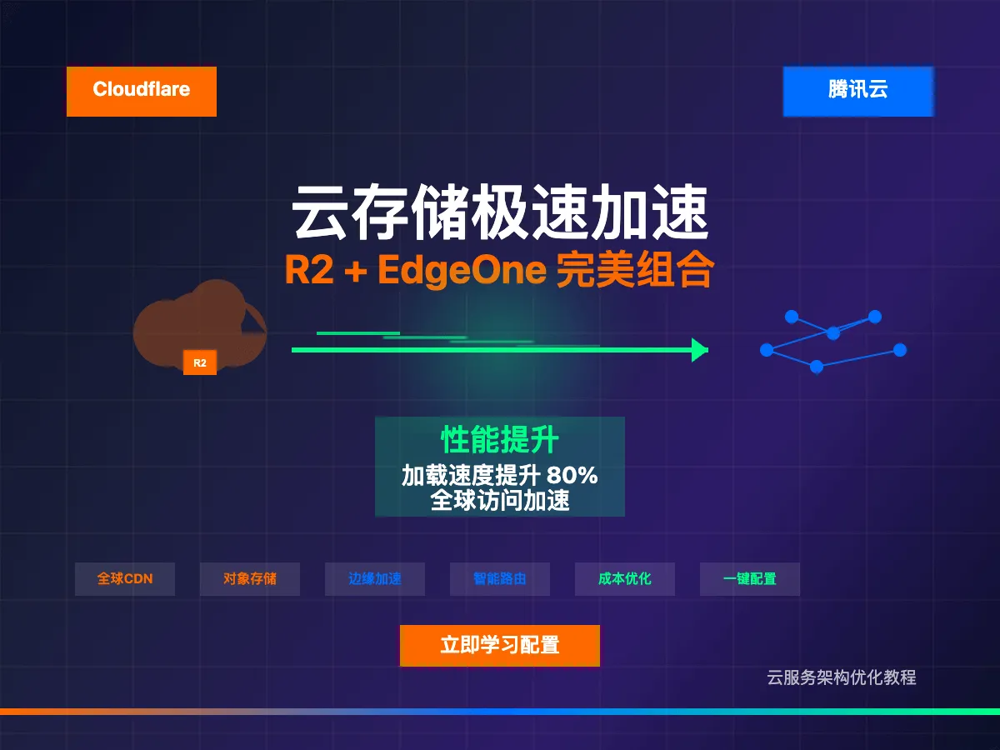

## **Bilibili**

## **1、先开启 cloudflare 的自定义域名**

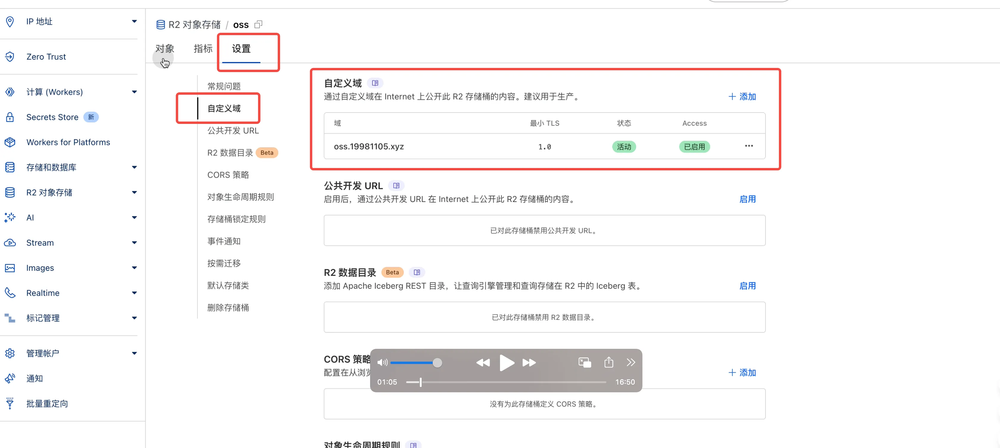

## **2、EdgeOne 添加 cdn 域名**

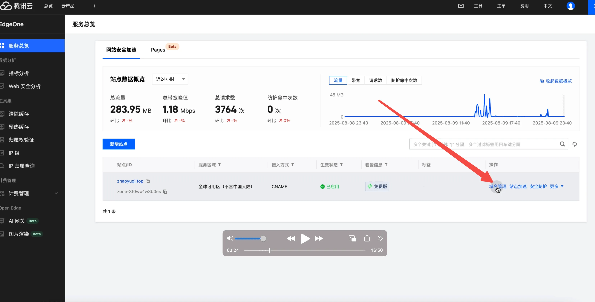

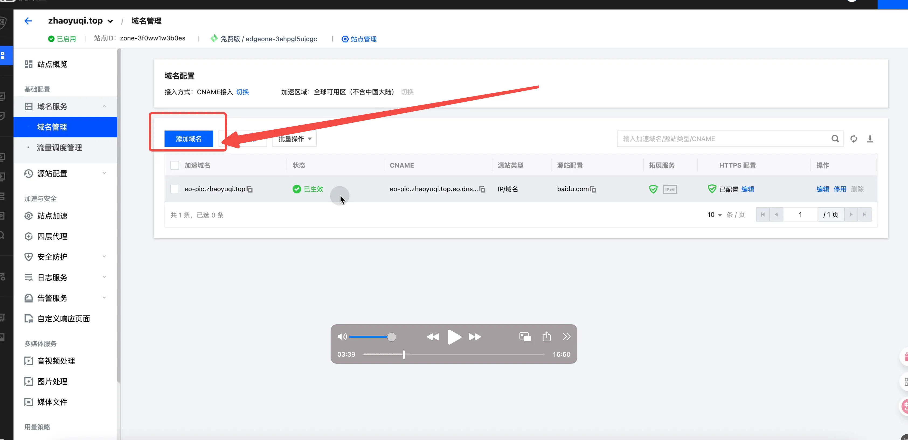

## **3、配置域名设置回源站点为 R2 的自定义域名站点**

_**经测试对网站的加速使用源站配置 对象存储源站可以加速，其他的不行**_

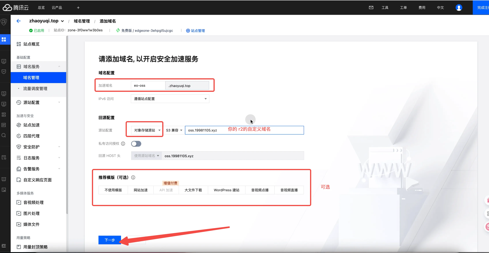

## **4、域名服务商配置域名的 cname 指向 EO 的 cname 地址**

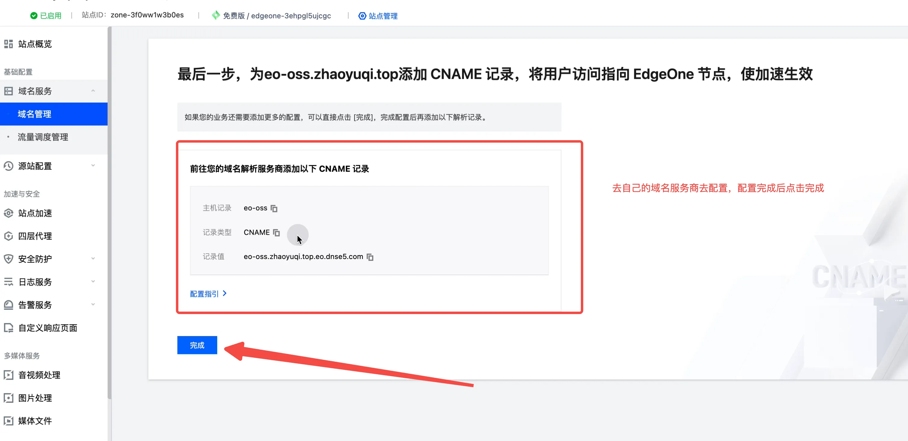

## **4、配置 https 证书**

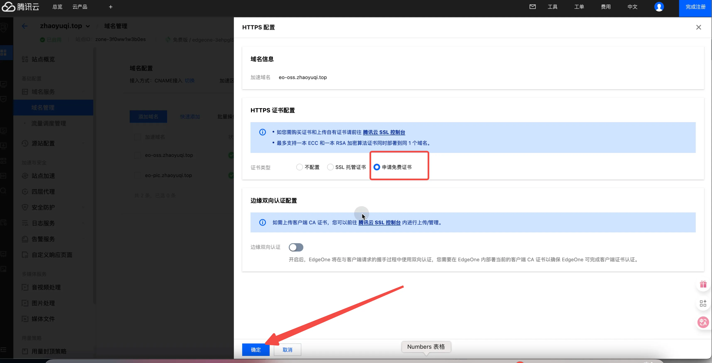

## **5、此时已经完成了 cdn 的操作，接下来我们配置边缘函数来将 png 转换为 webp 图片减小图片体积**

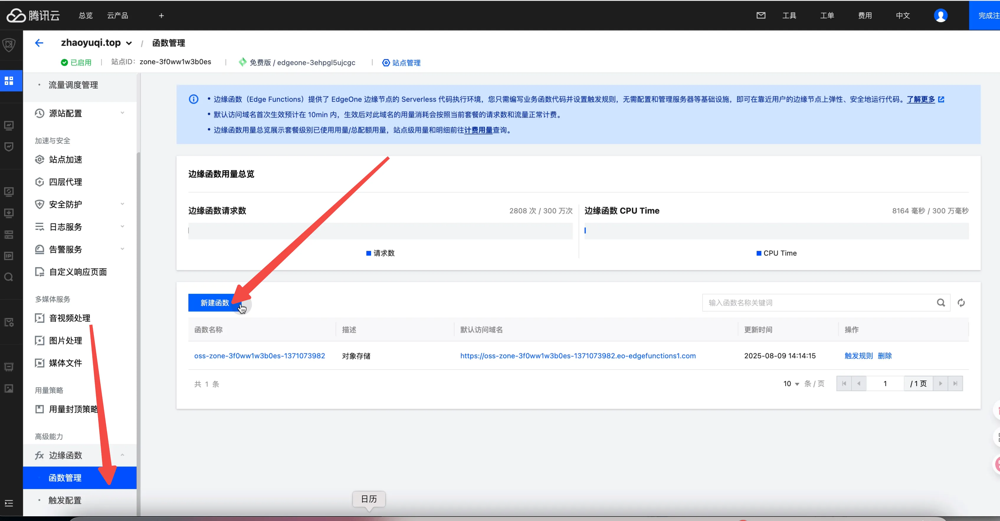

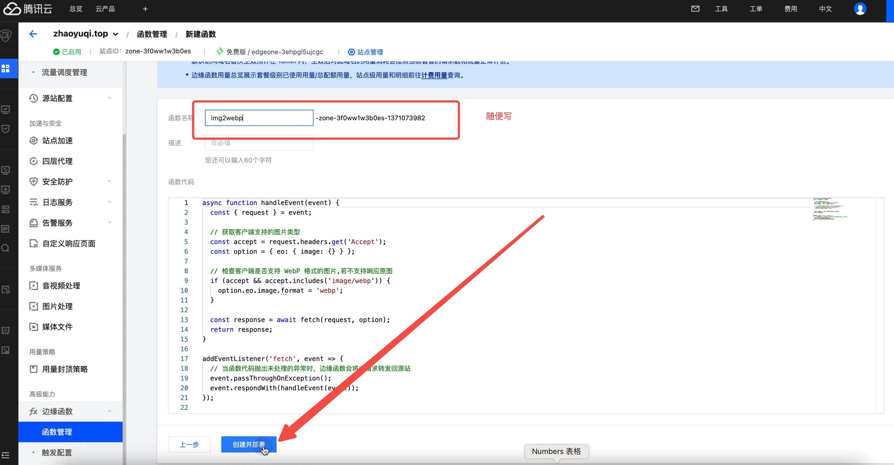

## **6、添加触发规则**

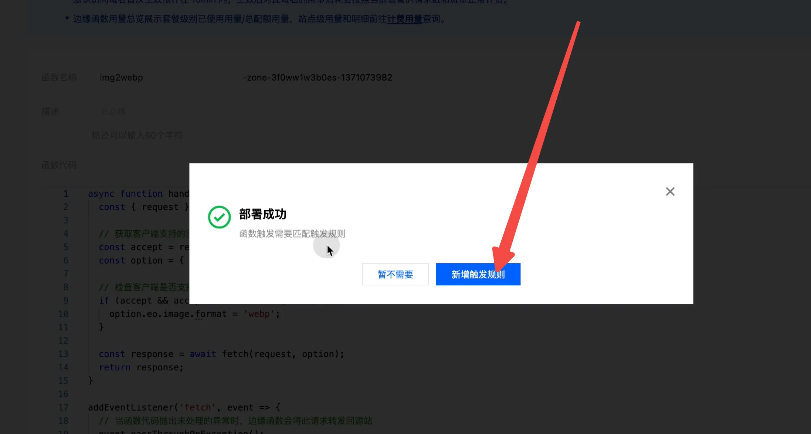

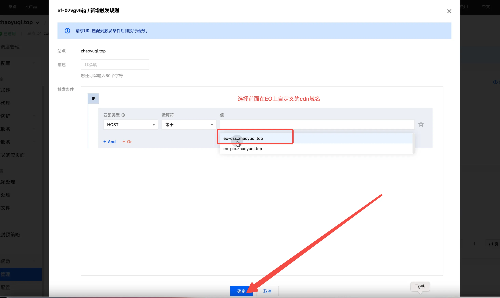

## **7、大功告成！附上前后对比图**

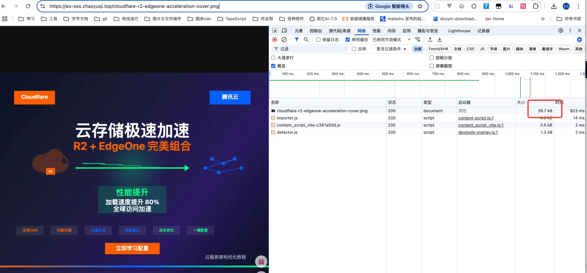

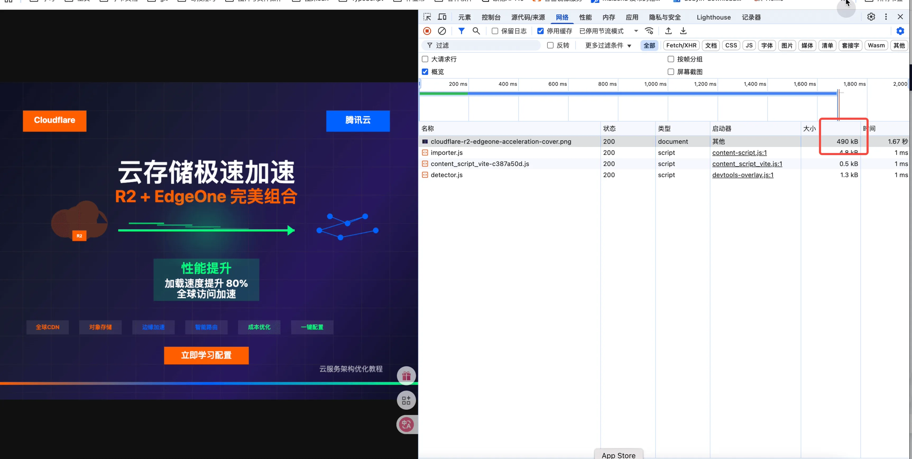

**cloudflare云存储极速加速，R2 + EdgeOne 完美组合**

[https://www.zhaoyuqi.top/posts/cloudflare-r2-edgeone/](https://www.zhaoyuqi.top/posts/cloudflare-r2-edgeone/)

作者

爱哭的赵一一

发布于

2025-08-10

许可协议

[CC BY-NC-SA 4.0](https://creativecommons.org/licenses/by-nc-sa/4.0/)

