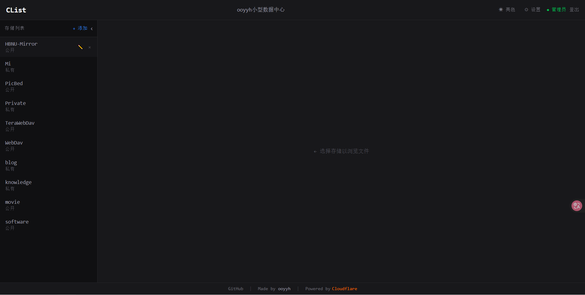


### **1.准备工作**


Nodejs环境(20左右)，Cloudflare账号x1，任意PSL域名x1（例如xx.kg，或者dpdns.org这样可以托管到cf的二级域名也行）


### **2.项目拉取**


使用git工具拉取项目即可


```shell
git clone https://github.com/ooyyh/Cloudflare-Clist.git
```


### **3.项目部署**


在你的cf账号内创建一个D1数据库并命名（例如clist）。


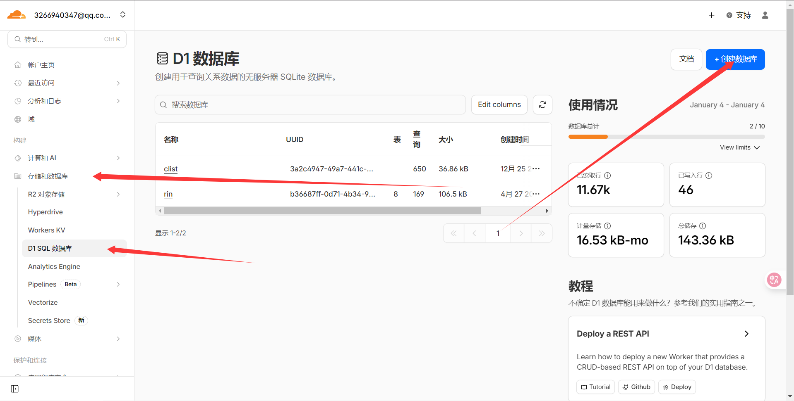


点击右边3个点进入浏览数据


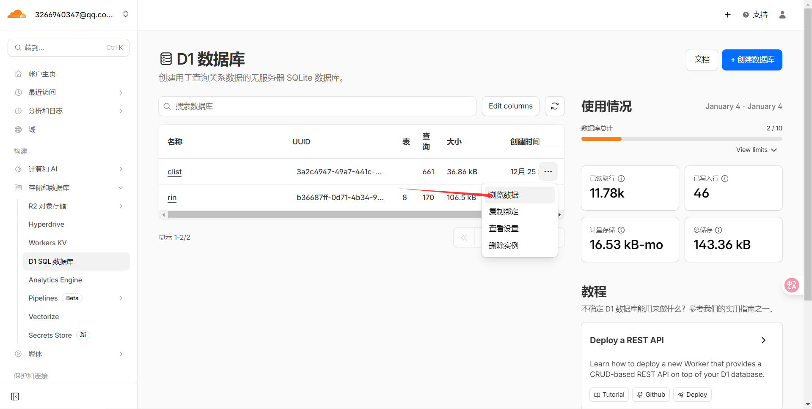


找到项目内的Schema.sql文件


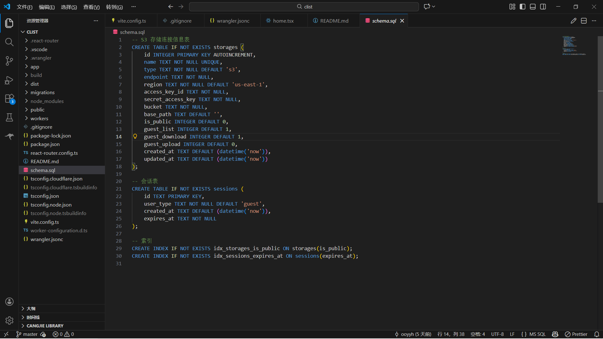


并在浏览数据内的查询里允许脚本内的建表语句后Run


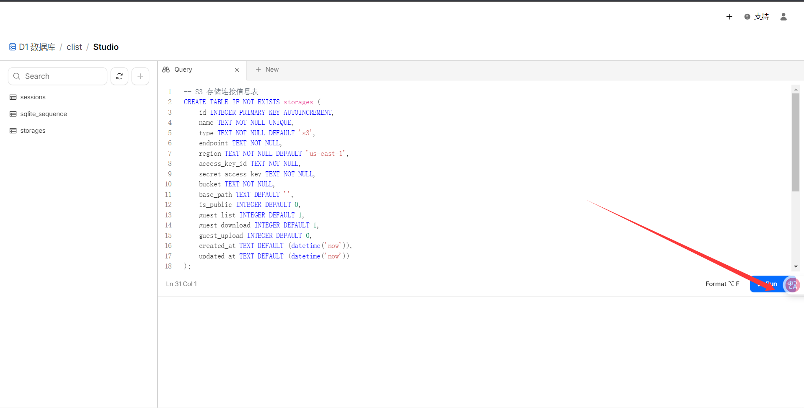


这下你就完成了所有准备的工作。接下来只需要把你的数据库名字和UUID复制填写到项目的wrangler.jsonc中即可


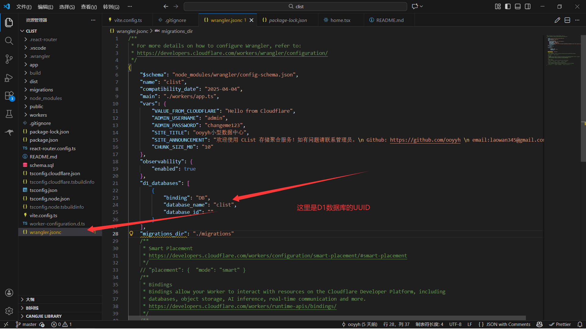


UUID在这里就可以获取


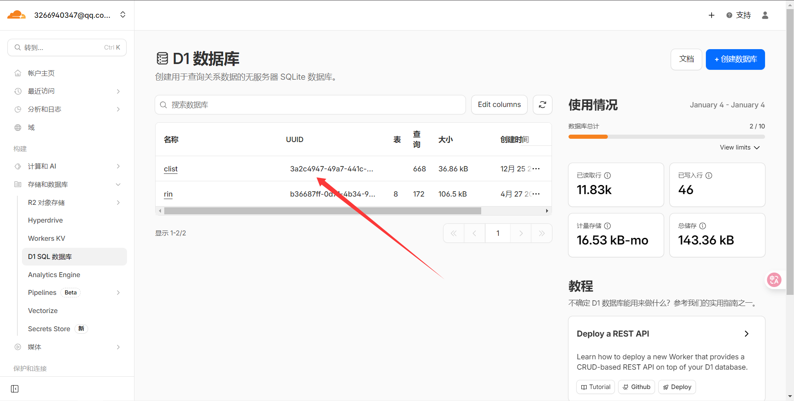


填写完成后在项目目录下npx wrangler login并根据提示让cloudflare授权给wrangler即可


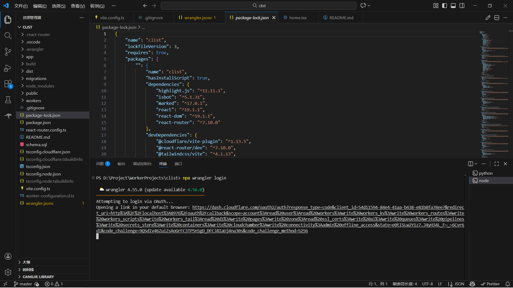


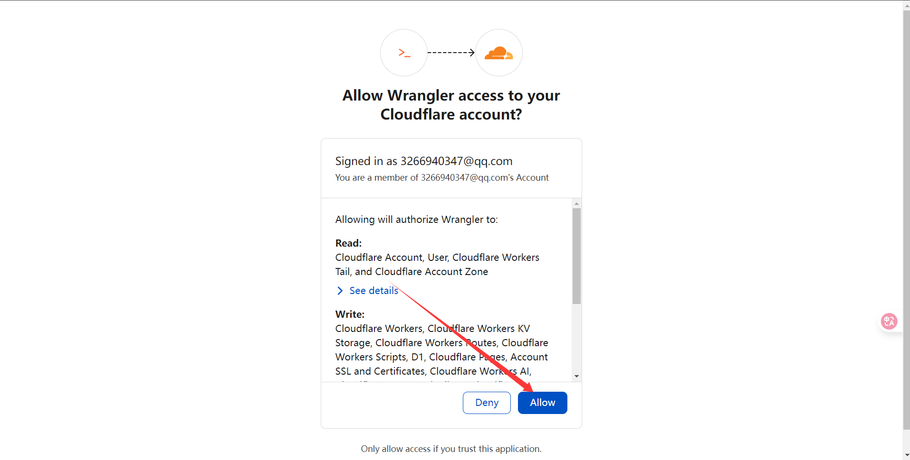


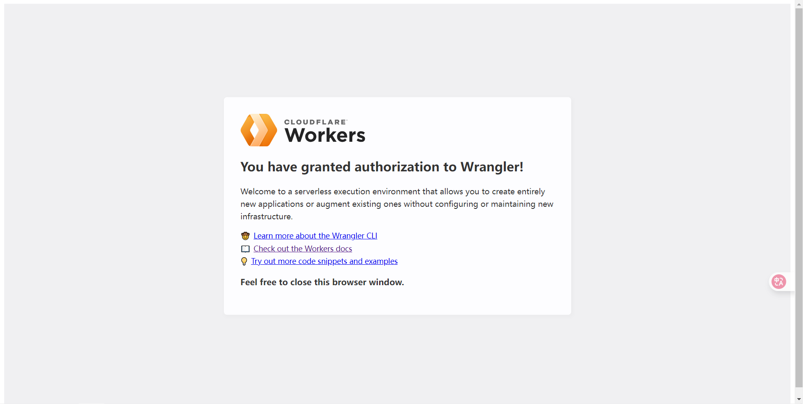


最后首先npm install下载依赖后npm run build构建之后npx wrangler deploy部署即可。初始账户名和密码是admin:changeme123 部署成功Belike:


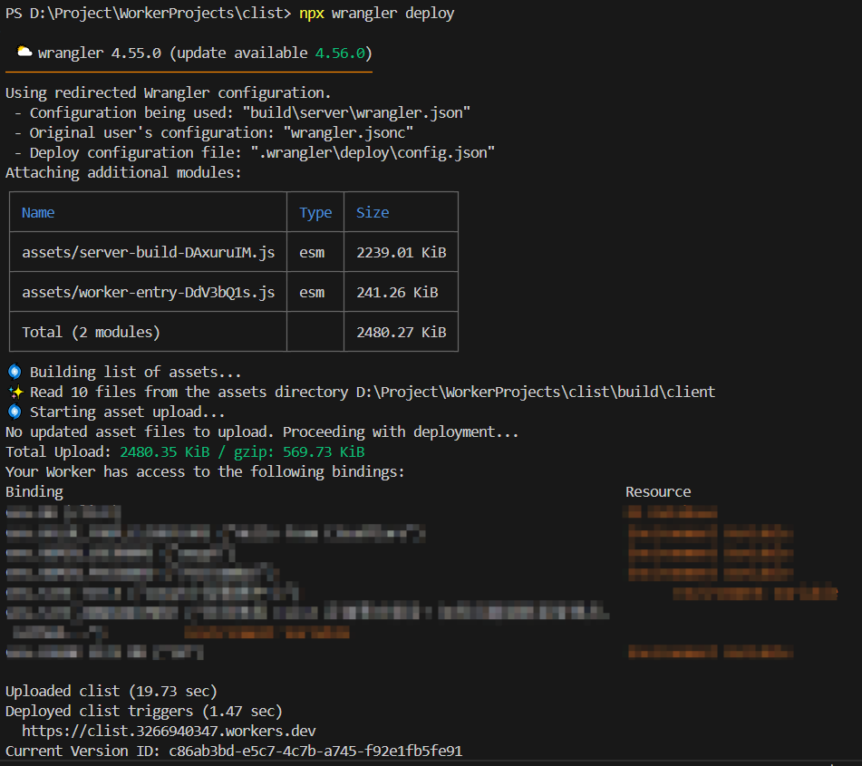


最下面给出的


[https://clist.3266940347.workers.dev](https://clist.3266940347.workers.dev/)


就是workers自动分配的地址了，这时我们可以去cloudflare为它绑定自定义的域名


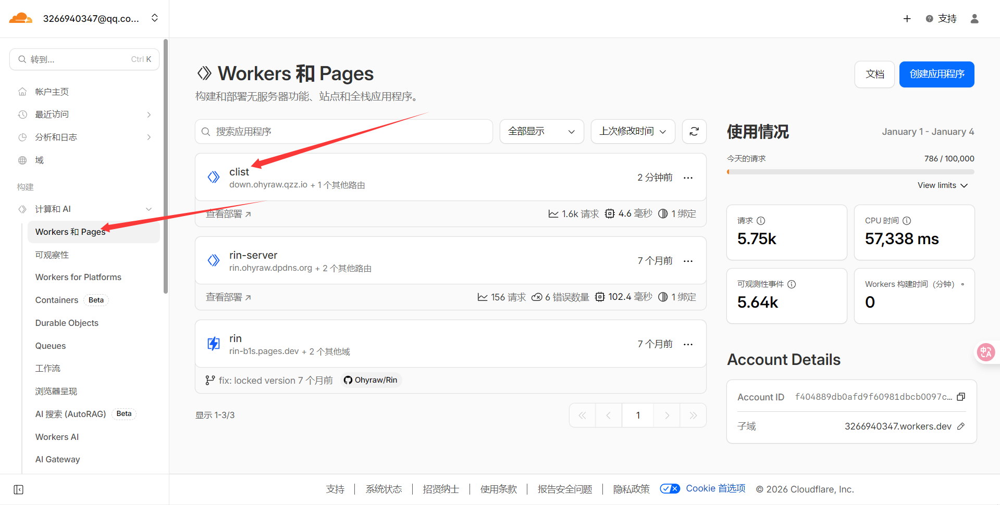


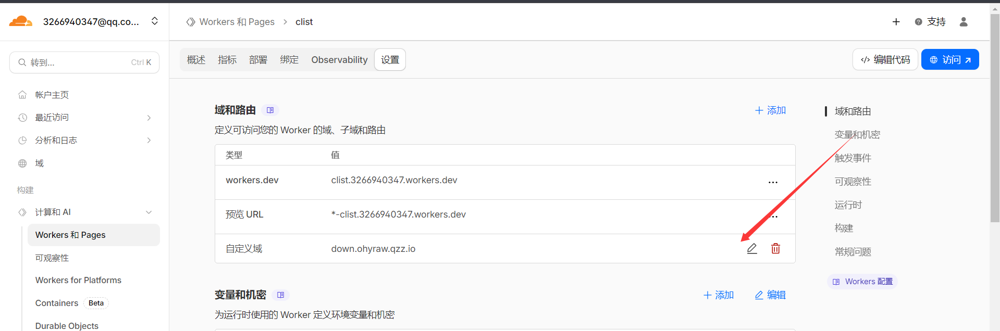


最后给一组该项目的环境变量（密码，公告，切片大小，标题，管理员账户，密码）


| **Key**               | **Value**             |
| --------------------- | --------------------- |
| VALUE_FROM_CLOUDFLARE | Hello from Cloudflare |
| ADMIN_USERNAME        | 管理员账户                 |
| ADMIN_PASSWORD        | 管理员密码                 |
| SITE_TITLE            | 标题                    |
| SITE_ANNOUNCEMENT     | 公告                    |
| CHUNK_SIZE_MB         | 上传最小切片，默认是10MB        |


可以在workers的设置里更改即可


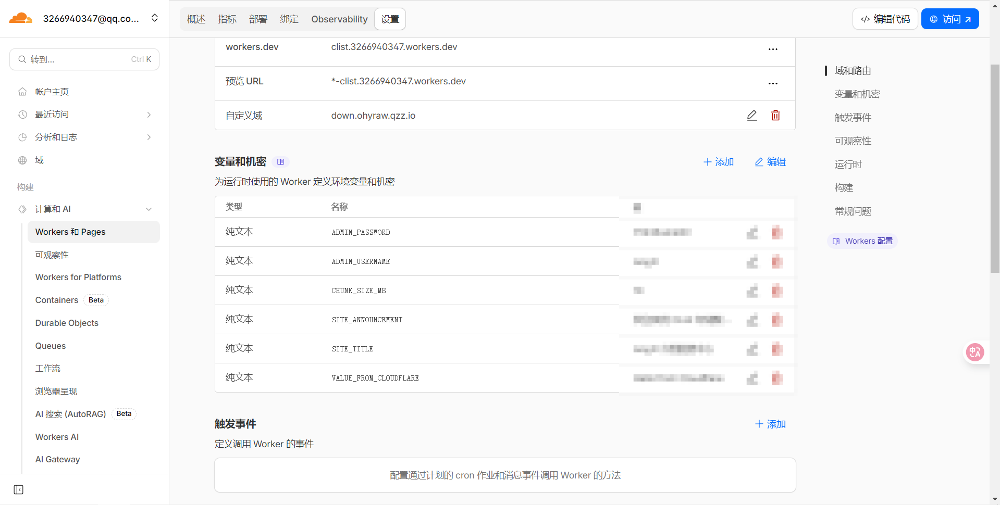


完成后你就可以在你的自定义域名看到这样的画面


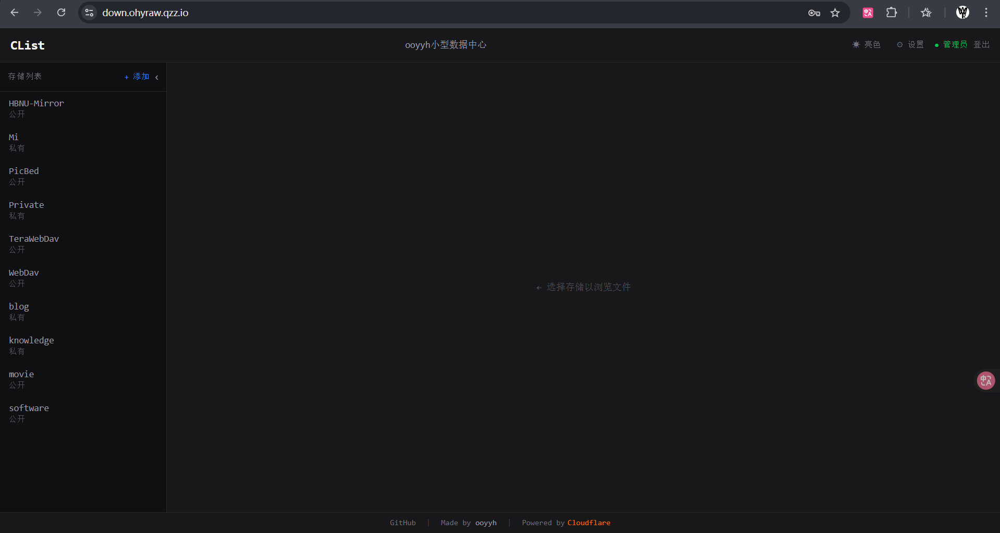


目前已经支持S3对象存储，WebDav


转载自：


[bookmark](https://blog.ooyyh.top/feed/13)

